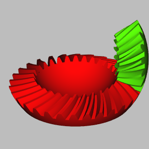

# A Gear module for FreeCAD

## Requirements
FreeCAD > v0.16

# Screenshots



## Supported gear-types

### Cylindric Involute
#### Shifting
#### Helical
#### Double Helical
#### Undercut

### Involute Rack

### Cylindric Cycloid
#### Helical
#### Double Helical

### Spherical Involute Bevel-Gear
#### Spiral

### Crown-Gear

---------------------------

## Installation

### Addon Manger  
Starting from v0.17 it's possible to use the built-in FreeCAD [Addon Manager](https://github.com/FreeCAD/FreeCAD-addons#1-builtin-addon-manager)
located in the `Tools` > `Addon Manager` dropdown menu.

### pip

`pip install https://github.com/looooo/FCGear/archive/master.tar.gz`

**Important note:** Most systems have multiple versions of python installed. Make sure the `pip` you're using is used by FreeCAD as well.

## Usage

### Create a gear manually
* Open freecad
* Switch to the gear workbench
* Create new document
* Create a gear (click on a gear symbol in the toolbar)
* Change the gear parameters

## Scripted gears
Use the power of python to automate your gear modeling: 

```python
import FreeCAD as App
import freecad.gears.commands
gear = freecad.gears.commands.CreateInvoluteGear.create()
gear.teeth = 20
gear.beta = 20
gear.height = 10
gear.double_helix = True
App.ActiveDocument.recompute()
Gui.SendMsgToActiveView("ViewFit")
```

## References
* Elements of Metric Gear Technology ([PDF](http://qtcgears.com/tools/catalogs/PDF_Q420/Tech.pdf))

### FreeCAD Forum threads
These are forum threads where FreeCAD Gears has been discussed. If you want to give Feedback
or report a bug please use the below threads. Please make sure that the report hasn't been reported already
by browsing this repositories [issue queue](https://github.com/looooo/freecad.gears/issues).   
* "CONTINUED: involute gear generator preview !" ([thread](https://forum.freecadweb.org/viewtopic.php?f=10&t=4829))  
* "Bevel gear - module/script/tutorial" ([thread](https://forum.freecadweb.org/viewtopic.php?f=3&t=12878))  
* "Gears in FreeCAD: FC Gear" ([thread](https://forum.freecadweb.org/viewtopic.php?f=24&t=27381))  
* "FC Gears: Feedback thread" ([thread](https://forum.freecadweb.org/viewtopic.php?f=8&t=27626))  

# License
GNU General Public License v2.0
