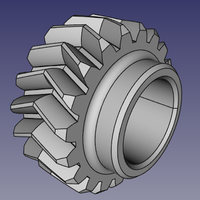
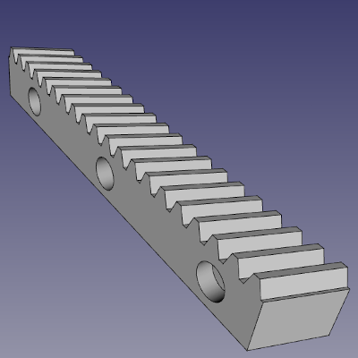
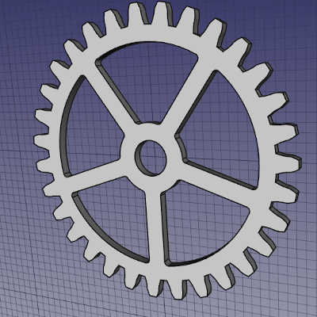
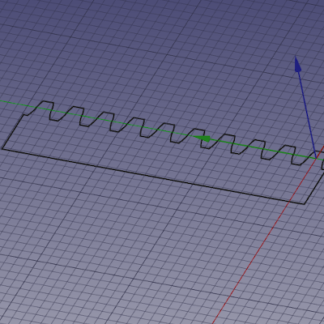
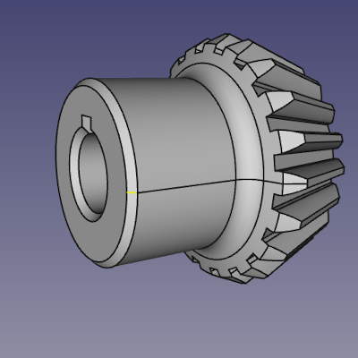
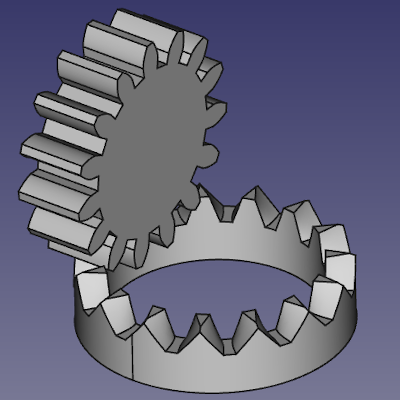
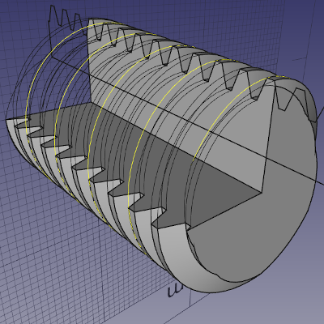
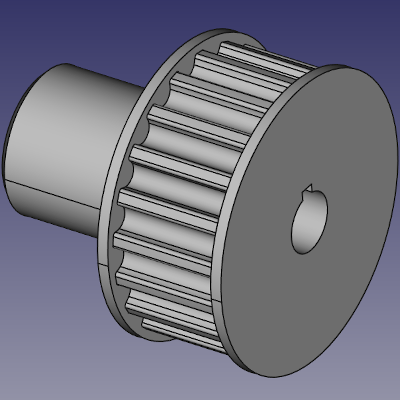
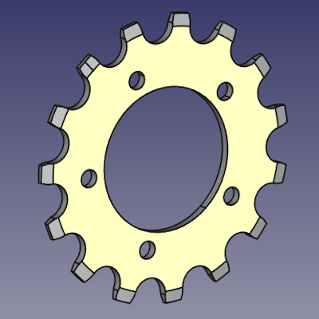

# FreeCAD Gears

A gear workbench for FreeCAD: create involute, cycloid, bevel, worm, timing, lantern and crown gears with full control over parameters.

[](https://github.com/looooo/freecad.gears/actions/workflows/ci.yml)
[](https://github.com/looooo/freecad.gears/actions/workflows/ci.yml)
[](https://github.com/looooo/freecad.gears/actions/workflows/ci.yml)
[](LICENSE)

## Requirements

- **FreeCAD** ≥ 1.0 (or ≥ 0.16 for older setups); CI tests against **1.1.3** (see [CI](#ci-github-actions))
- **Python** ≥ 3.8 (used by FreeCAD); CI uses **3.12.13**
- **Python packages:** `numpy`, `scipy`, `sympy` (optional: `jupyter`, `matplotlib`)

## Supported gear types

### Cylindric involute
- Shifting, helical, double helical, undercut, fillets



### Involute rack


### Cylindric cycloid
- Helical, double helical, fillets



### Cycloid rack


### Spherical involute bevel gear
- Spiral



### Crown gear


### Worm gear


### Timing gear


### Lantern gear


---

## Installation

### Addon Manager (recommended)
In FreeCAD: **Tools** → **Addon Manager** → search for “Gears” (or “FCGear”) → Install.

### pip
```bash
pip install freecad.gears
```
Or from source:
```bash
pip install https://github.com/looooo/freecad.gears/archive/master.tar.gz
```
Use the same Python/pip that FreeCAD uses on your system.

---

## Usage

### In FreeCAD
1. Open FreeCAD and switch to the **Gear** workbench.
2. **File** → **New** (or open a document).
3. Create a gear from the toolbar and adjust parameters in the property panel.

### From Python
```python
import FreeCAD as App
import freecad.gears.commands

gear = freecad.gears.commands.CreateInvoluteGear.create()
gear.num_teeth = 20
gear.beta = 20
gear.height = 10
gear.double_helix = True
App.ActiveDocument.recompute()
Gui.SendMsgToActiveView("ViewFit")
```

---

## Development

The project uses [pixi](https://pixi.sh/) for environment and task management.

### Setup
```bash
pixi install
```

### Tasks

| Command | Description |
|---------|-------------|
| `pixi run lint` | Run pylint. |
| `pixi run test` | Unit tests. |
| `pixi run test-visual` | Visual tests (requires display). |
| `pixi run test-visual-xvfb` | Visual tests under xvfb. |
| `pixi run test-all` | All tests. |
| `pixi run create-references` | Generate reference images. |
| `pixi run create-references-xvfb` | Generate reference images under xvfb. |
| `pixi run clean-test` | Remove test artifacts and references. |

Visual tests use [freecad.visual_tests](https://github.com/looooo/freecad.visual_tests): each project under `tests/data/*/` has a `metafile.yaml` and a `.FCStd` model; references are stored in `references/`.

### CI (GitHub Actions)

Workflow: [`.github/workflows/ci.yml`](.github/workflows/ci.yml) (push, pull request, manual dispatch).

| | |
|---|---|
| **FreeCAD** | 1.1.3 ([`pixi.lock`](pixi.lock), conda-forge) |
| **Python** | 3.12.13 ([`pixi.lock`](pixi.lock)) |
| **Unit tests** | Linux, macOS, Windows |
| **Visual tests** | Linux only (xvfb) |
| **Pylint** | Ubuntu; advisory only (does not fail the workflow) |

Manual workflow [Update reference images](.github/workflows/update-references.yml) regenerates reference images on CI and pushes them to the repo.

---

## References

- Elements of Metric Gear Technology ([PDF](http://qtcgears.com/tools/catalogs/PDF_Q420/Tech.pdf))

### FreeCAD Forum
- [Involute gear generator preview](https://forum.freecadweb.org/viewtopic.php?f=10&t=4829)
- [Bevel gear – module/script/tutorial](https://forum.freecadweb.org/viewtopic.php?f=3&t=12878)
- [Gears in FreeCAD: FC Gear](https://forum.freecadweb.org/viewtopic.php?f=24&t=27381)
- [FC Gears: Feedback thread](https://forum.freecadweb.org/viewtopic.php?f=8&t=27626)

Please check the [issue tracker](https://github.com/looooo/freecad.gears/issues) before opening a new report.

---

## License

GNU General Public License v3.0
